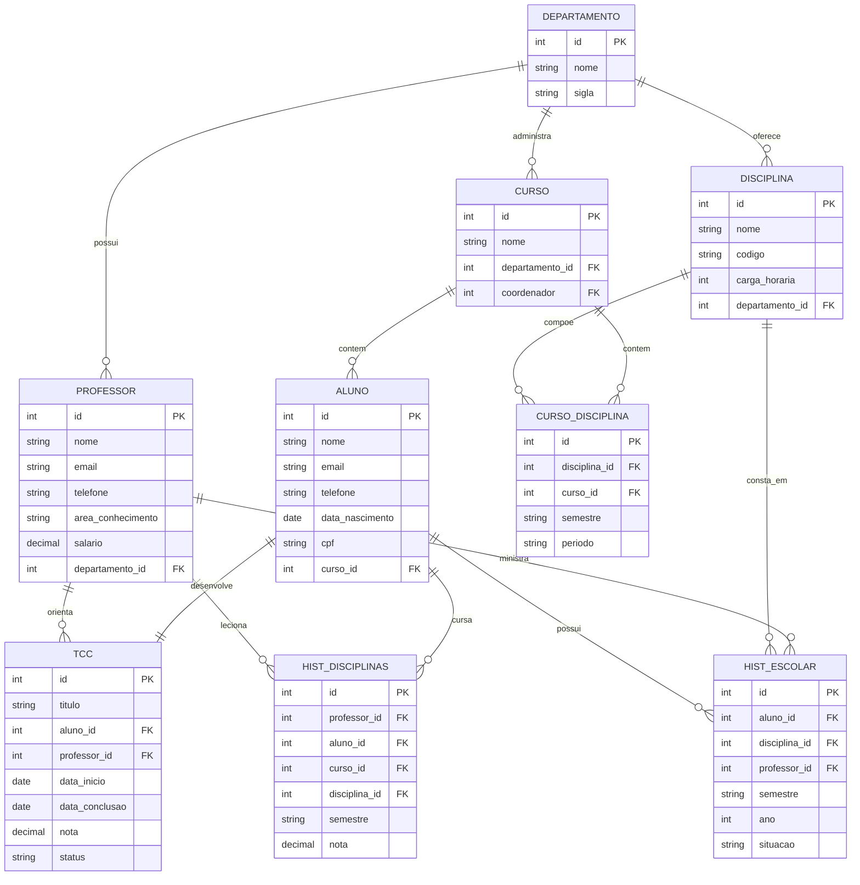

# BD_Universidade

```mermaid
erDiagram
    DEPARTAMENTO {
        int id PK
        string nome
        string sigla
    }
    
    PROFESSOR {
        int id PK
        string nome
        string email
        string telefone
        string area_conhecimento
        decimal salario
        int departamento_id FK
    }
    
    DISCIPLINA {
        int id PK
        string nome
        string codigo
        int carga_horaria
        int departamento_id FK
    }
    
    CURSO {
        int id PK
        string nome
        int departamento_id FK
        int coordenador FK
    }
    
    ALUNO {
        int id PK
        string nome
        string email
        string telefone
        date data_nascimento
        string cpf
        int curso_id FK
    }
    
    TCC {
        int id PK
        string titulo
        int aluno_id FK
        int professor_id FK
        date data_inicio
        date data_conclusao
        decimal nota
        string status
    }
    
    CURSO_DISCIPLINA {
        int id PK
        int disciplina_id FK
        int curso_id FK
        string semestre
        string periodo
    }
    
    HIST_DISCIPLINAS {
        int id PK
        int professor_id FK
        int aluno_id FK
        int curso_id FK
        int disciplina_id FK
        string semestre
        decimal nota
    }
    
    HIST_ESCOLAR {
        int id PK
        int aluno_id FK
        int disciplina_id FK
        int professor_id FK
        string semestre
        int ano
        string situacao
    }
    
    DEPARTAMENTO ||--o{ PROFESSOR : possui
    DEPARTAMENTO ||--o{ DISCIPLINA : oferece
    DEPARTAMENTO ||--o{ CURSO : administra
    PROFESSOR ||--o{ TCC : orienta
    CURSO ||--o{ ALUNO : contem
    ALUNO ||--|| TCC : desenvolve
    DISCIPLINA ||--o{ CURSO_DISCIPLINA : compoe
    CURSO ||--o{ CURSO_DISCIPLINA : contem
    PROFESSOR ||--o{ HIST_DISCIPLINAS : leciona
    ALUNO ||--o{ HIST_DISCIPLINAS : cursa
    ALUNO ||--o{ HIST_ESCOLAR : possui
    DISCIPLINA ||--o{ HIST_ESCOLAR : consta_em
    PROFESSOR ||--o{ HIST_ESCOLAR : ministra

```
