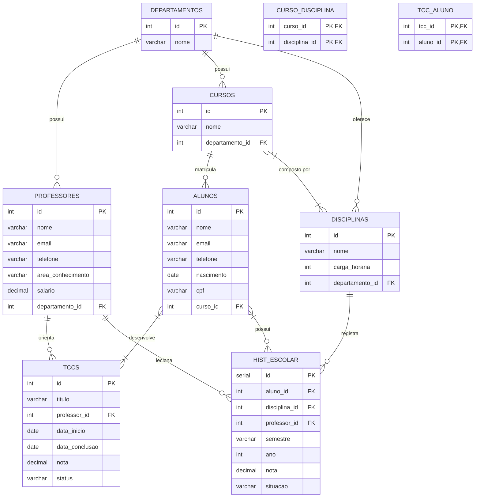

#### Isabella Benevenuto RA: 22.123.007-1
#### Mateus Marana       RA: 22.123.026-1
---

# 🏛️ Projeto: Banco de Dados Universitário

Este projeto simula o ambiente acadêmico de uma universidade por meio de um banco de dados relacional completo. Ele foi desenvolvido com o objetivo de apoiar atividades de ensino e prática em:

- 📐 Modelagem de dados (MER e DDL)
- 🧬 Geração de dados fictícios com Python
- ✅ Validação de integridade e consistência dos dados
- 🔍 Execução e testes de queries SQL com Supabase (PostgreSQL)

A base contempla os principais elementos de um sistema acadêmico:

- *Departamentos*
- *Professores*
- *Cursos*
- *Disciplinas*
- *Alunos*
- *Histórico escolar*
- *Trabalhos de Conclusão de Curso (TCCs)* com grupos de alunos

Todos os relacionamentos foram modelados de forma a refletir situações reais de uma universidade.

---

## 🛠️ Como Executar o Projeto

### 1. 📦 Pré-requisitos

- Python 3.10 ou superior
- Conta no [Supabase](https://supabase.io)
- Instalar as bibliotecas Python:

```bash
pip install pandas numpy supabase
---
```



