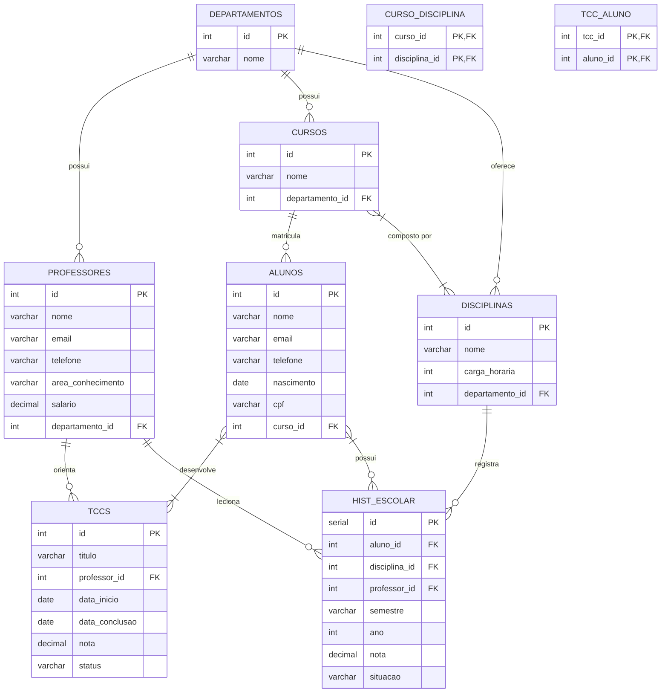

#### Isabella Benevenuto RA: 22.123.007-1
#### Mateus Marana       RA: 22.123.026-1
---

## 🎓 **Sistema de Gestão Acadêmica**

Este projeto visa a criação de um **sistema de gestão acadêmica** para uma universidade, onde é possível gerenciar **cursos, alunos, professores, disciplinas e departamentos**, além de registrar **históricos escolares** e gerenciar **TCCs**. O sistema é desenvolvido utilizando um **banco de dados relacional** com tabelas interligadas, permitindo o armazenamento e consulta eficiente das informações acadêmicas.

### 📊 **Estrutura do Banco de Dados**

O banco de dados foi modelado utilizando um **Modelo Entidade-Relacionamento (MER)**, que foi convertido em um **Modelo Relacional (MR)**, composto pelas seguintes tabelas principais:

#### 1. **Departamento**
   - Representa os departamentos acadêmicos, que são responsáveis pela gestão dos cursos e disciplinas.
   - Atributos: `id`, `nome`, `chefe_id`.

#### 2. **Curso**
   - Cada curso está vinculado a um departamento e pode conter várias disciplinas.
   - Atributos: `id`, `nome`, `departamento_id`, `coordenador`, `disciplina_id`.

#### 3. **Professor**
   - Armazena informações sobre os professores, que ministram disciplinas e orientam os TCCs dos alunos.
   - Atributos: `id`, `nome`, `email`, `telefone`, `data_nascimento`, `salario`, `departamento_id`, `curso_id`.

#### 4. **Disciplina**
   - Representa as disciplinas oferecidas nos cursos, incluindo o professor responsável e o semestre de oferecimento.
   - Atributos: `id`, `nome`, `codigo`, `carga_horaria`, `departamento_id`, `curso_id`, `professor_id`, `semestre`, `obrigatoria`.

#### 5. **Aluno**
   - Armazena as informações dos alunos matriculados nos cursos e as disciplinas que eles cursaram.
   - Atributos: `id`, `nome`, `matricula`, `email`, `telefone`, `data_nascimento`, `sexo`, `curso_id`, `disciplina_id`.

#### 6. **Histórico de Disciplinas**
   - Registra o histórico das disciplinas ministradas, incluindo informações sobre o professor, semestre e ano letivo.
   - Atributos: `professor_id`, `disciplina_id`, `curso_id`, `departamento_id`, `semestre`, `ano`.

#### 7. **Histórico Escolar**
   - Armazena as notas dos alunos nas disciplinas cursadas, além da situação acadêmica (aprovado, reprovado).
   - Atributos: `aluno_id`, `disciplina_id`, `professor_id`, `semestre`, `nota`, `situacao`.

#### 8. **TCC**
   - Representa os Trabalhos de Conclusão de Curso dos alunos, incluindo o título, data de início e término, nota final e status.
   - Atributos: `id`, `titulo`, `aluno_id`, `professor_id`, `data_inicio`, `data_fim`, `nota`, `status`, `projeto`.

### 🔗 **Relacionamentos**

- **Departamento** possui **Cursos** e **Professores**.
- **Curso** possui **Disciplinas**, **Alunos** e **Professores**.
- **Disciplina** é ministrada por um **Professor** e pode ser cursada por vários **Alunos**.
- **Aluno** tem um **Histórico Escolar** e realiza um **TCC** com a orientação de um **Professor**.
- **Histórico de Disciplinas** armazena a relação de **Professores** com as **Disciplinas** e os **Cursos**.

### ⚙️ **Tecnologias Usadas**

- **Banco de Dados**: MySQL
- **Linguagem de Programação**: SQL
- **Ferramentas**: VS Code (para criação dos dados, validação, e script SQL)
- 
### 🚀 **Instruções para Execução**

1. **Configuração do Banco de Dados**:
   - Execute o script SQL para criar as tabelas no seu SGBD preferido.
   - Certifique-se de que as chaves estrangeiras estão corretamente configuradas para manter a integridade referencial.

2. **População do Banco de Dados**:
   - Adicione dados iniciais nas tabelas **Departamento**, **Curso**, **Professor**, **Disciplina**, **Aluno**, entre outras, conforme necessário para testar o sistema.

3. **Consultas**:
   - Utilize consultas SQL para visualizar o histórico escolar dos alunos, as disciplinas de um curso, ou os TCCs orientados por um professor, entre outras funcionalidades.

---

